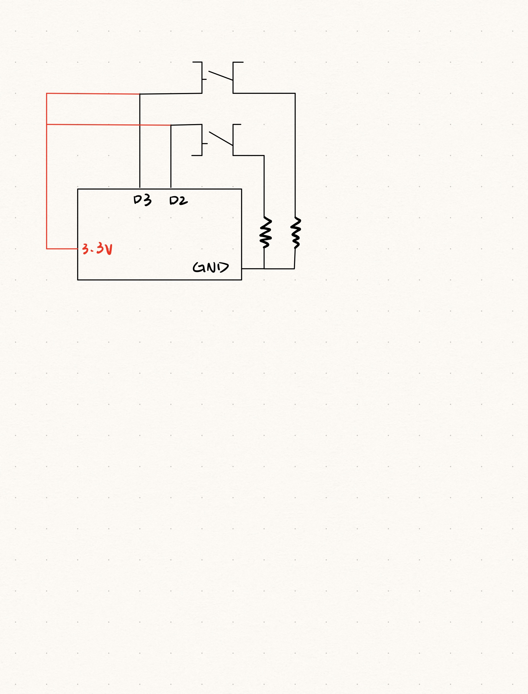

**Schematic drawing of the circuit**

**Description of your logic**  
Reads data from the serial port. It interprets data to update the left and right movement based on external button presses. Establishes the serial connection and hides the connect button once connected.
